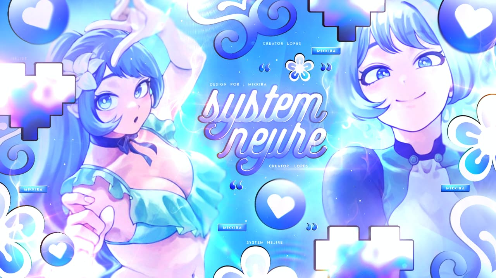
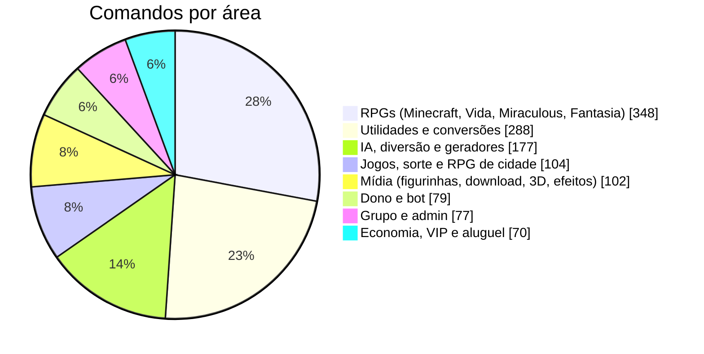
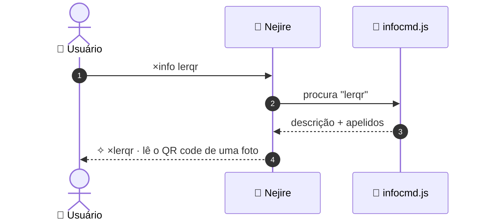
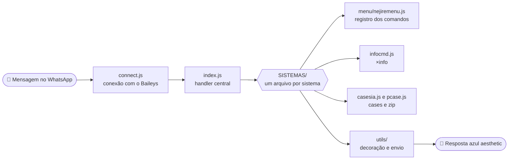
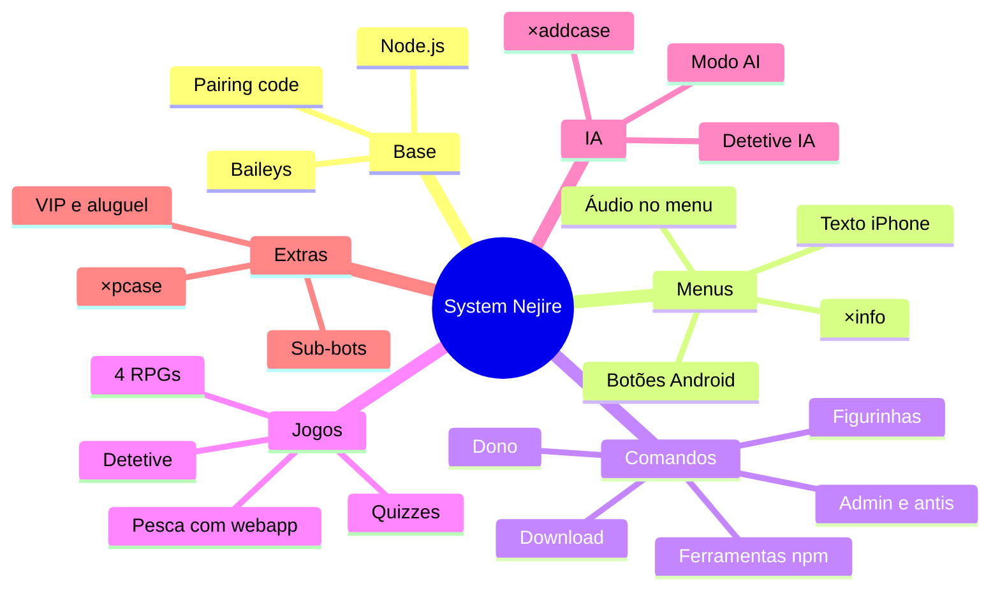
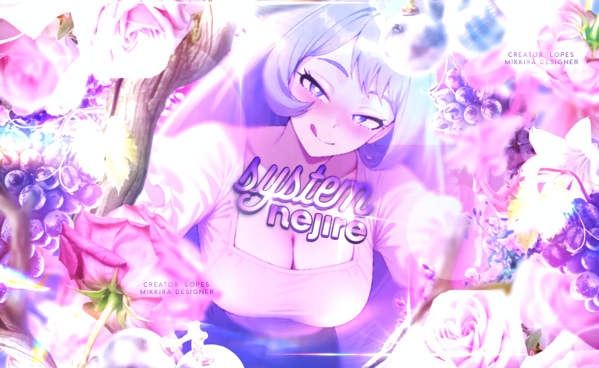

<div align="center">


<a href="https://git.io/typing-svg"></a>

<br/>


[](https://whatsapp.com/channel/0029Vb8rVXsDOQIWsbKuAd34)
[](https://wa.me/5567998229189)
[](https://lopes-api.store)

<br/>



<br/>

**𓆩🩵𓆪 ⋆｡° ʙᴏᴛ ᴅᴇ ᴡʜᴀᴛsᴀᴘᴘ ᴄᴏᴍ ɪᴅᴇɴᴛɪᴅᴀᴅᴇ ᴀᴢᴜʟ ᴀᴇsᴛʜᴇᴛɪᴄ °｡⋆ 𓆩🩵𓆪**


</div>

<br/>

> [!IMPORTANT]
> 🩵 **Obrigado por baixar essa base!** Ela é **gratuita** e foi feita com muito carinho.
> Qualquer dúvida, é só chamar o [suporte](https://wa.me/5567998229189) e **siga o [canal](https://whatsapp.com/channel/0029Vb8rVXsDOQIWsbKuAd34) para receber as ATUALIZAÇÕES**.
> 🚫 **É proibido vender, revender ou cobrar por esta base.** Se você pagou por ela, foi enganado(a).


## 📚 Índice

<table>
<tr>
<td>

1. [O que é](#-o-que-é)
2. [Novidades da v3.4](#-novidades-da-v34)
3. [O que o bot faz](#-o-que-o-bot-faz)
4. [Info dos comandos](#-info-dos-comandos)
5. [Cases criadas pela IA](#-cases-criadas-pela-ia)
6. [Puxar uma case (pcase)](#-puxar-uma-case-pcase)
7. [Como funciona](#-como-funciona)
8. [Requisitos](#-requisitos)

</td>
<td>

9. [Instalação](#-instalação)
10. [Primeiro login (pairing code)](#-primeiro-login-pairing-code)
11. [Configuração (`config.json`)](#-configuração-configjson)
12. [Como usar](#-como-usar)
13. [Áudio do menu](#-áudio-do-menu)
14. [Menu auto](#-menu-auto)
15. [Estrutura do projeto](#-estrutura-do-projeto)
16. [Adicionar um comando novo](#-como-adicionar-um-comando-novo)
17. [Deixar rodando 24h](#-deixar-rodando-24h)
18. [Atualizar o bot](#-atualizar-o-bot)
19. [Segurança](#-segurança)
20. [Problemas comuns](#-problemas-comuns)
21. [Suporte, regras e créditos](#-suporte-regras-e-créditos)

</td>
</tr>
</table>

<div align="right"><a href="#readme">⬆️ voltar ao topo</a></div>

---

## 💙 O que é

O **System Nejire** é um bot de WhatsApp feito em **Node.js** em cima da biblioteca **Baileys** (`@systemzero/baileys`), inspirado na Nejire Hado. Todas as respostas passam por uma decoração azul/oceano (fontes miúdas, emojis azuis e molduras), e o menu principal é interativo, com foto, botões e lista.

O login é feito por **código de pareamento** (sem QR code), então dá pra rodar até no celular, pelo Termux.

<div align="center">

| 🩵 | 🎮 | 🧠 | 🔎 | 📦 |
|:-:|:-:|:-:|:-:|:-:|
| **1.240+**<br/>comandos | **4**<br/>RPGs completos | **IA**<br/>que cria comandos | **×info**<br/>descrição direta | **×pcase**<br/>case em zip |

</div>

> [!TIP]
> Para ver tudo dentro do WhatsApp, mande `×menu`. Para saber o que um comando faz, mande `×info nome-do-comando`.

## 🆕 Novidades da v3.4

| | Novidade | Como usar |
|:-:|---|---|
| 🔎 | **Menus limpos + `×info`**: as descrições saíram dos menus (ficou só o nome dos comandos) e agora aparecem sob demanda | `×info lerqr` |
| 📦 | **`×pcase`**: puxa a case de um comando e manda em `.zip` (só dono) | `×pcase play` |
| 🧠 | **Cases criadas pela IA**: peça um comando em português e a IA escreve a case, valida e já deixa funcionando | `×addcase` |
| 📢 | **`×postarstatus`**: posta status de grupo (texto, imagem, vídeo ou áudio) | `×postarstatus oi` |
| 🧩 | **Ferramentas npm**: cards, QR, pix, código de barras, OCR, PDF, agenda, xadrez, minificador e mais | `×menucat_ferramentas` |
| 🛡️ | **Mais antis**: fig, imagem, vídeo, áudio, doc, contato, localização, enquete, trava, fake, porn, canal, bot, pagamento, flood… | `×antis` |
| 🎧 | **Áudio no menu**: o dono marca um áudio e ele sai junto com o menu | `×definiraudiomenu` |
| 🕵️ | **Detetive IA**: casos completos com suspeitos, evidências e interrogatório | `×casos` |
| 🤖 | **Menu auto**: `autofigu`, `autoemoji`, `autotoimg`, `autodl`, `autoreact` — com pack e autor de cada pessoa (nada global) | `×menuauto` |

<div align="right"><a href="#readme">⬆️ voltar ao topo</a></div>

## ✨ O que o bot faz

São **46 categorias** e mais de **1.240 comandos**[^1], fora os apelidos:



| | Categoria | O que tem |
|:-:|---|---|
| 👑 | **Dono** | broadcast, backup, autobackup, ligar/desligar comandos, adicionar donos, trocar nome/foto/recado do bot, `pcase`, etc. |
| 🫐 | **Admin** | antis (link, fig, imagem, vídeo, áudio, doc, trava, fake, porn, canal, bot…), ban, promover, rebaixar, advertências, `postarstatus` |
| 🐚 | **Boas-vindas** | mensagem de entrada e saída de grupo, configurável |
| 🗣️ | **Figurinhas** | criar, converter, cortar, bordas, efeitos, trocar pack/autor |
| 🏊 | **Download** | play (áudio/vídeo), TikTok, Instagram, Spotify, Pinterest, letra de música, `gitclone` e `npm` em zip |
| 🧊 | **Cubo 3D** | renderizador 3D próprio que gera imagem/vídeo/figurinha |
| 🌊 | **IA & diversão** | IA de conversa, modo AI com memória, memes, piadas, frases, curiosidades, geradores de nomes |
| 🧩 | **Utilidades** | calculadoras, mais de 75 conversores, texto, data e hora, cifras, validadores |
| 🛠️ | **Ferramentas npm** | cards e imagens, QR e pix, OCR, PDF, agenda, xadrez, formatadores de código |
| 🕵️ | **Detetive** | jogo de investigação com casos |
| 🎲 | **Jogos & sorte** | quiz, roleta, dados, loteria, cartas, sinuca, forca, jogo da velha |
| 💞 | **Sociais** | namoro e casamento, tinder, zoeira |
| 💎 | **VIP / Aluguel** | planos VIP e aluguel do bot para grupos |
| 🐾 | **Sistemas** | economia, XP, ranking, perfil, daily, trabalho, guildas, lembretes, tarefas, diário |
| 🎣 | **Pesca** | jogo de pesca completo, com **mini app web** |
| 🎮 | **RPGs** | **Minecraft RPG**, **Simulador de Vida**, **Miraculous RPG** e **Fantasia RPG** (87 comandos cada) |

<details>
<summary><b>🎮 Ver os 4 RPGs</b></summary>

<br/>

| RPG | Ajuda | Começar |
|---|---|---|
| ⛏️ Minecraft RPG | `×mcajuda` | `×mccomecar` |
| 🏙️ Simulador de Vida | `×vdajuda` | `×vdcomecar` |
| 🐞 Miraculous RPG | `×mrajuda` | `×mrcomecar` |
| 🐉 Fantasia RPG | `×faajuda` | `×facomecar` |

Use `×rpgs` para listar todos.

</details>

<details>
<summary><b>➕ Outros recursos</b></summary>

<br/>

- 🤖 **Sub-bots**: qualquer pessoa pode virar um sub-bot do Nejire (`×subbot 5511999999999`).
- 🧠 **Modo AI**, **antipv**, **anticall**, **autoler**, **presença** e **autobackup**.
- 📱 **Menu por dispositivo**: menu com botões (Android) ou menu em texto (iPhone).
- 🎧 **Áudio no menu**: o dono marca um áudio e ele sai junto toda vez que o menu é pedido.
- 🚫 **`×bangp`**: neste grupo o bot só responde o dono.
- 🧪 **`×testarzone`**: testa todos os endpoints da API de uma vez.
- 📦 **Auto-instalação**: o `autoinstall.js` instala sozinho qualquer módulo que estiver faltando.

</details>

<div align="right"><a href="#readme">⬆️ voltar ao topo</a></div>

## 🔎 Info dos comandos

Os menus mostram **só o nome dos comandos**, bem limpinhos. Quando você quiser saber o que um comando faz, é só perguntar:

```
×info lerqr
```

```
✧ ×lerqr
lê o QR code de uma foto
🔁 ×lerqrcode
```

<div align="center">



</div>

| Você manda | O bot responde |
|---|---|
| `×info play` | a descrição direta do comando |
| `×info lerqrcode` | funciona com **apelido**, e mostra o nome principal |
| `×info backup` | avisa quando o comando é **👑 só dono** |
| `×info pla` | não achou? sugere comandos parecidos |

Apelidos do próprio comando: `×infocmd`, `×cmdinfo`, `×descricao`.

> [!NOTE]
> As descrições ficam todas em **`SISTEMAS/infocmd/descricoes.json`** (um arquivo só, fácil de editar). No fim de cada menu aparece a dica `💡 ×info [comando]`.

<div align="right"><a href="#readme">⬆️ voltar ao topo</a></div>

## 🧠 Cases criadas pela IA

O dono descreve o comando que quer, **a IA escreve a case**, o bot valida e instala na hora, sem reiniciar.

| Comando | O que faz |
|---|---|
| `×addcase <pedido>` | a IA cria um comando novo a partir do que você pediu |
| `×vercase <nome>` | mostra o código do comando criado |
| `×delcase <nome>` | remove o comando criado |
| `×menucases` | menu só com os comandos criados pela IA |

Exemplo:

```
×addcase um comando que sorteia uma cor e manda o nome dela
```

- Os comandos criados ficam em `data/casesia/cases.json` e voltam sozinhos quando o bot reinicia.
- Cada case passa por uma **validação de segurança** antes de rodar: ela não pode acessar arquivos, `process`, `eval`, `child_process`, a `config.json`, nem usar loops infinitos. Só `axios`, `crypto` e `path` são liberados.
- Se o nome já existir no bot, a IA escolhe outro nome automaticamente.
- Usa a `zoneApi` do `config.json` (endpoint `gpt6luna`), então precisa da sua chave configurada.

> [!WARNING]
> Mesmo com a validação, só o **dono** deve usar esses comandos. Leia o código com `×vercase` antes de liberar um comando criado pela IA pra todo mundo.

<div align="right"><a href="#readme">⬆️ voltar ao topo</a></div>

## 📦 Puxar uma case (pcase)

O `×pcase` encontra o código de qualquer comando e **manda em `.zip`**. É exclusivo do dono.

```
×pcase play                  → manda no seu PV
×pcase play @fulano          → manda no PV da pessoa marcada
×pcase play 5511999999999    → manda no PV do número informado
```

| | |
|---|---|
| 🔍 **Onde procura** | cases do `index.js`, módulos da pasta `SISTEMAS/` e cases criadas pela IA |
| 🔁 **Apelidos** | `×pcase rename` traz o código do `take`, e assim por diante |
| 🗂️ **O que vem no zip** | só o trecho do comando, com um cabeçalho dizendo o arquivo e as linhas de origem |
| 👑 **Quem usa** | só o dono do bot |

Apelidos do comando: `×pegarcase`, `×puxarcase`.

> [!CAUTION]
> O zip contém **código do bot**. Marque só pessoas de confiança.
> Comandos gerados em loop (como os antis de grupo) não têm um trecho próprio, então o `×pcase` avisa que não achou.

<div align="right"><a href="#readme">⬆️ voltar ao topo</a></div>

## 🧬 Como funciona



<details>
<summary><b>🧭 Mapa mental do projeto</b></summary>



</details>

## 📦 Requisitos

-  e **npm** (recomendado Node 20+)
-  instalado (usado em figurinhas animadas, áudio e vídeo)
- 📱 Um **número de WhatsApp** só pro bot (não use o seu principal)
- 🌐 Internet estável

<div align="center">


</div>

## 🛠️ Instalação

<details open>
<summary><b>🐧 Linux / VPS (Ubuntu, Debian)</b></summary>

```bash
sudo apt update && sudo apt install -y git ffmpeg nodejs npm
git clone https://github.com/kauanbreno179-stack/System-Nejire.git
cd System-Nejire
npm install
```

</details>

<details>
<summary><b>📱 Termux (Android)</b></summary>

```bash
pkg update && pkg upgrade -y
pkg install -y git nodejs ffmpeg
git clone https://github.com/kauanbreno179-stack/System-Nejire.git
cd System-Nejire
npm install
```

</details>

<details>
<summary><b>🪟 Windows</b></summary>

1. Instale o [Node.js LTS](https://nodejs.org) e o [Git](https://git-scm.com).
2. Instale o [ffmpeg](https://ffmpeg.org/download.html) e coloque no `PATH`.
3. No terminal:

```bash
git clone https://github.com/kauanbreno179-stack/System-Nejire.git
cd System-Nejire
npm install
```

</details>

> [!NOTE]
> O arquivo `autoinstall.js` roda toda vez que o bot inicia e instala sozinho qualquer módulo que estiver faltando.

## 🔑 Primeiro login (pairing code)

1. Configure o `config.json` (veja a próxima seção), principalmente o **`numeroDono`**.
2. Inicie o bot:

   ```bash
   npm start
   ```

3. O terminal vai pedir: **"Número da Nejire, com DDI e DDD"**. Digite o número do bot, só números. Exemplo: `5511999999999`.
4. Vai aparecer um **código de 8 letras/números**.
5. No WhatsApp do bot: **Aparelhos conectados → Conectar um aparelho → Conectar com número de telefone** e digite o código **em até 60 segundos**.
6. Quando aparecer `✅ System Nejire conectada!`, está pronto.

A sessão fica salva em `sessions/main`. Nas próximas vezes o bot conecta sozinho.

> [!WARNING]
> Se a sessão quebrar (deslogada ou revogada), apague a pasta `sessions/main` e faça o pareamento de novo. **Nunca suba a pasta `sessions/` para o GitHub**, ela é o login do bot.

## ⚙️ Configuração (`config.json`)

| Campo | Para que serve |
|---|---|
| `nome` | Nome do bot, usado nos menus e rodapés |
| `versao` | Versão exibida (dá pra mudar com `×definirversao`) |
| `prefixo` | Prefixo dos comandos. Hoje é `×` |
| `numeroDono` | **Seu número**, com DDI e DDD, só números. É ele que libera os comandos de dono |
| `nomeDono` | Seu nome |
| `emojiPrincipal` | Emoji usado nas reações |
| `tema` | Cores do tema (`corPrincipal`, `corSecundaria`, `corDestaque`) |
| `figurinha` | `packname` e `author` das figurinhas |
| `canal` | `id`, `nome` e `url` do canal do WhatsApp (aparece no menu) |
| `plataforma.padrao` | `auto`, `android` ou `iphone`. Define se o menu sai com botões ou em texto |
| `webapp` | `habilitado`, `porta` e `urlPublica` do mini app de pesca. Troque `localhost` pelo seu IP/domínio |
| `zoneApi` | URL, **sua apikey** e endpoints usados por IA (`×gpt`, `×addcase`), TTS e buscas |
| `lopesApi` | URL e **seu token** da API usada pelos downloaders |
| `modoai` | Limites do modo AI (histórico por pessoa e tamanho da resposta) |
| `boasVindas` | Textos de entrada e saída de grupo (`@user`, `@group` e `@membros` são trocados automaticamente) |
| `vip.planos` / `aluguel.planos` | Planos, dias e preços |
| `economia` | Nome da moeda e limites do `daily` |
| `decoracao` | Liga/desliga a decoração azul e a fonte miúda |

> [!IMPORTANT]
> Coloque **a sua própria apikey** em `zoneApi.apikey` e o **seu token** em `lopesApi.token`. Sem elas, IA, `×addcase`, TTS, buscas e downloads não funcionam. Depois de configurar, use `×testarzone` para testar os endpoints.

## 🚀 Como usar

O prefixo padrão é `×`. Alguns exemplos:

| Comando | O que faz |
|---|---|
| `×menu` | Abre o menu principal |
| `×info lerqr` | Mostra a descrição de um comando |
| `×ping` | Testa se o bot está vivo |
| `×figurinha` | Cria figurinha de uma imagem/vídeo (envie ou responda) |
| `×play nome da música` | Baixa e envia a música |
| `×pesca` | Abre o painel de pesca |
| `×rpgs` | Lista os 4 RPGs |
| `×alugar` | Mostra os planos de aluguel |
| `×subbot 5511999999999` | Cria um sub-bot |
| `×modo-adr` / `×modo-ios` | Escolhe o menu com botões ou em texto |
| `×addcase <pedido>` | A IA cria um comando novo (dono) |
| `×pcase <comando>` | Manda a case do comando em zip (dono) |

<div align="right"><a href="#readme">⬆️ voltar ao topo</a></div>

## 🎧 Áudio do menu

Você marca um áudio uma vez, o bot guarda e, **toda vez que alguém pedir o menu** (`×menu`, `×nejire`, `×help`, `×ajuda`), ele manda o menu **e logo depois o áudio**.

### Como configurar

1. Envie (ou encaminhe) o áudio que você quer no chat com o bot.
2. **Marque (responda) esse áudio** com:

   ```
   ×definiraudiomenu
   ```

3. Pronto. O bot salva em `menu/audio/` e já deixa ativo.
4. Teste com `×menu` ou com `×testaraudiomenu`.

### Comandos (só o dono usa)

| Comando | O que faz |
|---|---|
| `×definiraudiomenu` | Marque um áudio para salvar como áudio do menu (também aceita mp3 enviado como arquivo) |
| `×audiomenu` | Mostra o status (ligado/desligado e se tem áudio salvo) |
| `×audiomenu on` / `×audiomenu off` | Liga ou desliga sem apagar o áudio |
| `×testaraudiomenu` | Manda o áudio salvo só pra você ouvir |
| `×removeraudiomenu` | Apaga o áudio salvo |

Apelidos: `×setaudiomenu`, `×addaudiomenu`, `×delaudiomenu`, `×rmaudiomenu`, `×testeaudiomenu`.

> [!NOTE]
> - O áudio é guardado no formato original: **nota de voz** sai como nota de voz, **mp3/áudio comum** sai como áudio comum.
> - Limite de **16 MB** (limite do WhatsApp para áudio). Prefira arquivos pequenos.
> - Se o envio do áudio falhar, o menu **continua saindo normalmente**.
> - Para trocar o áudio, é só marcar outro com `×definiraudiomenu`.

## 🤖 Menu auto

Comandos que ficam **ligados** e agem sozinhos em toda mensagem que não é comando. O exemplo clássico: com o `×autofigu` ligado, toda **imagem, vídeo ou GIF** que a pessoa mandar vira figurinha na hora, sem digitar nada.

Abre o menu com `×menuauto` (ou `×auto`).

### Automáticos

| Comando | O que faz |
|---|---|
| `×autofigu` | imagem, vídeo e GIF viram figurinha |
| `×autoemoji` | mensagem só com **um** emoji vira figurinha do emoji |
| `×autotoimg` | figurinha vira imagem (animada vira vídeo/GIF) |
| `×autodl` | link de TikTok, Instagram (post/reel/tv) e YouTube Shorts baixa o vídeo sozinho |
| `×autoreact` | o bot reage nas mensagens com um emoji |

### Quem liga e pra quem vale

| Onde / como | Quem usa | Vale pra |
|---|---|---|
| `×autofigu on` / `off` **no grupo** | admin | todo mundo do grupo |
| `×autofigu eu on` / `eu off` | qualquer pessoa | só as mídias dela, no pv e em qualquer grupo |
| `×autofigu on` / `off` **no pv** | a própria pessoa | só ela |
| `×autofigu eu padrao` | qualquer pessoa | volta a seguir o grupo |

Regra: quem **desligou** (`eu off`) nunca é convertido, mesmo que o grupo ligue. Quem **ligou** (`eu on`) é convertido em qualquer lugar. Quem não decidiu segue o grupo (e no pv fica desligado). Todos os automáticos funcionam igual (`×autodl eu on`, `×autoreact off`…).

### Pack e autor de cada pessoa (nada é global)

O pack, o autor, o modo e o efeito das figurinhas automáticas são **da pessoa que mandou a mídia** — não do bot, não do grupo. Num grupo com `autofigu` ligado, cada membro recebe a figurinha com o pack e o autor dele.

| Comando | Exemplo |
|---|---|
| `×autopack <texto>` | `×autopack figurinhas da {nome}` |
| `×autoautor <texto>` | `×autoautor {nome} • {data}` |
| `×autofigumodo <modo>` | `×autofigumodo circulo` (padrao, circulo, quadrado, esticar, borda) |
| `×autofigufx <efeito>` | `×autofigufx sepia` (`×autofigufx nenhum` tira) |
| `×autoresetfigu` | volta tudo ao padrão |

Dá pra usar variáveis no pack e no autor: `{nome}` (nome do WhatsApp da pessoa), `{numero}`, `{grupo}`, `{bot}`, `{data}`, `{hora}`.
**Padrão** de quem nunca configurou: pack = `{nome}` e autor = `{bot}`.

### Painel

| Comando | O que faz |
|---|---|
| `×autostatus` | mostra o que está ligado (no grupo e pra você) e como ficam seu pack e autor |
| `×autooff` | desliga todos os automáticos pra você |

### Limites e proteções

- Mídia **"ver uma vez"** nunca vira figurinha (é privada).
- Vídeo com mais de 60 s ou arquivo com mais de 30 MB é ignorado.
- Legenda começando com o prefixo (ex.: `×sticker`) é tratada como comando normal, não como automático.
- Fila: no máximo 2 conversões ao mesmo tempo e 3 pedidos pendentes por pessoa — o excesso é descartado pra não travar o bot.
- `autodl` tem pausa de 20 s por pessoa, `autoemoji` 3 s e `autoreact` 6 s.
- O dono pode desligar um automático pro bot inteiro com `×cmdoff autofigu` (e religar com `×cmdon autofigu`).

As escolhas ficam em `database/auto.json` (não sobe pro GitHub).

<div align="right"><a href="#readme">⬆️ voltar ao topo</a></div>

## 🗂️ Estrutura do projeto

<details>
<summary><b>📁 Ver a árvore de pastas</b></summary>

```
System-Nejire/
├── connect.js              # ponto de entrada: conecta no WhatsApp (npm start)
├── index.js                # handler central: recebe as mensagens e chama os comandos
├── subbot.js               # sistema de sub-bots
├── autoinstall.js          # instala módulos faltando ao iniciar
├── config.json             # configuração do bot
├── package.json
├── SISTEMAS/               # a lógica dos comandos, um arquivo por sistema
│   ├── infocmd.js          # ×info (descrição dos comandos)
│   ├── infocmd/
│   │   └── descricoes.json # todas as descrições dos comandos
│   ├── pcase.js            # ×pcase (case em zip, só dono)
│   ├── casesia.js          # ×addcase, ×delcase, ×vercase, ×menucases
│   ├── postarstatus.js     # postar status de grupo
│   ├── menuaudio.js        # áudio do menu
│   ├── modulosnpm/         # cards, qr, pix, ocr, pdf, agenda, xadrez…
│   ├── auto/               # menu auto (autofigu, autoemoji, autotoimg, autodl, autoreact)
│   ├── lote2/              # calculadoras, conversões, geradores…
│   ├── lote3/              # os 4 RPGs (minecraft, vida, miraculous, fantasia)
│   └── cubo3d/             # renderizador 3D
├── menu/
│   ├── nejiremenu.js       # registro central de TODOS os comandos e categorias
│   ├── menuzero.js         # menu interativo com botões
│   ├── botoes.js           # montagem dos botões/listas
│   ├── foto/               # imagens do menu
│   └── audio/              # áudio do menu (criado por ×definiraudiomenu)
├── assets/                 # fontes usadas nas imagens geradas
├── utils/                  # funções de apoio (envio, decoração, jid, ffmpeg, db…)
├── sticker/                # metadados de figurinha (exif)
├── webapp/                 # mini app web da pesca (Express)
├── data/                   # dados fixos e cases criadas pela IA (data/casesia)
├── database/               # dados dos usuários (JSON, criados automaticamente)
└── sessions/               # sessão do WhatsApp (não sobe pro GitHub)
```

</details>

## ➕ Como adicionar um comando novo

Cada sistema em `SISTEMAS/` exporta uma função `tratar(ctx)` que devolve `true` quando o comando era dele. Exemplo mínimo:

```js
// SISTEMAS/oi.js
async function tratar({ command, reply, prefix }) {
    if (command !== "oizinho") return false;
    await reply(`oii! use ${prefix}menu pra ver meus comandos 🩵`);
    return true;
}
module.exports = { tratar };
```

Depois:

1. No `index.js`, importe o arquivo e chame-o junto dos outros, antes do `switch (command)`:

   ```js
   const Oi = require("./SISTEMAS/oi.js");
   // ...
   if (await Oi.tratar({ conn, info, from, sender, isGroup, isDono, args, q, command, prefix, config,
     reply, reagir, enviar, getMediaBuffer, exigirGrupo, exigirAdmin, exigirDono })) return;
   ```

2. Em `menu/nejiremenu.js`, adicione o comando na categoria certa dentro de `CATEGORIAS` (sem descrição, o menu fica limpo):

   ```js
   { cmd: "oizinho", desc: "" }
   ```

3. Coloque a descrição em `SISTEMAS/infocmd/descricoes.json`, é ela que aparece no `×info oizinho`:

   ```json
   "oizinho": "manda um oi"
   ```

> [!TIP]
> Helpers que já vêm no `ctx`: `reply(texto)`, `reagir(emoji)`, `enviar(conn, jid, conteudo)`, `getMediaBuffer(msg, tipo)`, `exigirDono()`, `exigirAdmin()`, `exigirGrupo()`.
>
> Se você deixar `desc: "manda um oi"` direto no menu, o bot também aceita: ele tira do menu sozinho e guarda pro `×info`.
>
> Quer criar comandos sem escrever código? Use o `×addcase` e deixe a IA fazer.

## ♻️ Deixar rodando 24h

Com **PM2** (recomendado em VPS):

```bash
npm install -g pm2
pm2 start connect.js --name nejire
pm2 save
pm2 startup
```

Comandos úteis: `pm2 logs nejire`, `pm2 restart nejire`, `pm2 stop nejire`.

> [!IMPORTANT]
> Faça o **primeiro login** com `npm start` (precisa digitar o número). Depois que a sessão existir, pode usar o PM2.

No Termux: `pkg install tmux`, abra uma sessão (`tmux`) e rode `npm start` dentro dela.

## 🔄 Atualizar o bot

```bash
cd System-Nejire
git pull
npm install
pm2 restart nejire   # se estiver usando PM2
```

> [!TIP]
> Antes de atualizar, faça um backup com `×backup` (o zip chega no PV do dono). Para backup automático, use `×autobackup 12` (a cada 12 horas).

## 🔐 Segurança

- 🚫 **Nunca suba** `sessions/`, `database/` nem a sua `config.json` com chaves reais para um repositório público.
- 🔑 Guarde sua apikey e seu token só no seu servidor/celular.
- 👑 Só coloque como dono quem você confia: o dono tem acesso a `×pcase`, `×addcase`, `×backup` e `×broadcast`.
- 🧠 Leia com `×vercase` o que a IA criou antes de confiar no comando.
- 📵 Use um número só pro bot, nunca o seu principal.

## 🩹 Problemas comuns

<details>
<summary><b>Ver a tabela de problemas e soluções</b></summary>

<br/>

| Problema | Solução |
|---|---|
| O código de pareamento não conecta | Digite em até 60s, com o número certo (DDI + DDD). Se falhar, apague `sessions/main` e tente de novo |
| `Sessão deslogada` / `403` | Apague `sessions/main` e faça o pareamento de novo |
| `Conflito: outra sessão ativa` | O mesmo número está conectado em outro lugar. Feche a outra instância |
| Erro `405` | Limite de taxa do WhatsApp: o bot espera 60s sozinho e reconecta |
| Figurinha/áudio não funciona | Instale o **ffmpeg** |
| Menu sem botões | Use `×modo-adr` (Android) ou ajuste `plataforma.padrao` no `config.json` |
| O áudio do menu não sai | Confira `×audiomenu` (precisa estar ligado e com áudio salvo) e teste com `×testaraudiomenu` |
| Erro de módulo não encontrado | Rode `npm install` |
| IA, TTS ou busca não respondem | Confira sua apikey em `zoneApi` e rode `×testarzone` |
| Download não funciona | Confira o token em `lopesApi` |
| `×info` diz que o comando não tem descrição | Adicione a linha dele em `SISTEMAS/infocmd/descricoes.json` |
| `×pcase` não achou a case | Confira o nome com `×menu`; comandos gerados em loop não têm trecho próprio |
| `×pcase` não chega no PV da pessoa | O contato precisa já ter falado com o bot ao menos uma vez |

</details>

## 🖼️ Galeria

<div align="center">

<table>
<tr>
<td align="center"><br/><sub>🩵 menu azul</sub></td>
<td align="center"><br/><sub>💜 menu rosa e uvas</sub></td>
</tr>
</table>

<sub>🎨 design das artes por <b>Mikkira</b></sub>

</div>

## 🌐 Veja minha API

<div align="center">

[](https://lopes-api.store)

</div>

## 📈 Estatísticas do projeto

<div align="center">

<a href="https://github.com/kauanbreno179-stack/System-Nejire">
  
</a>

<br/><br/>

<a href="https://star-history.com/#kauanbreno179-stack/System-Nejire&Date">
  
</a>

<br/><br/>

**👥 Contribuidores**

<a href="https://github.com/kauanbreno179-stack/System-Nejire/graphs/contributors">
  
</a>

</div>

> [!TIP]
> Gostou? Deixe uma ⭐ no repositório e siga o [canal](https://whatsapp.com/channel/0029Vb8rVXsDOQIWsbKuAd34) pra não perder as atualizações.

## 📜 Suporte, regras e créditos

| | |
|---|---|
| 💬 **Suporte** | [wa.me/5567998229189](https://wa.me/5567998229189) |
| 📢 **Canal (atualizações)** | [Clique para seguir](https://whatsapp.com/channel/0029Vb8rVXsDOQIWsbKuAd34) |
| 👤 **Criador** | **Lopes** (by lopes) |
| 🎨 **Design das artes** | **Mikkira** |
| 📚 **Base** | [Baileys](https://github.com/WhiskeySockets/Baileys) (`@systemzero/baileys`) |
| 📄 **Licença** | MIT (veja o campo `license` do `package.json`) |

> [!CAUTION]
> ✖ **Proibido vender, revender ou cobrar** por esta base, total ou parcialmente.
> ✖ **Proibido remover os créditos** do criador.
> ✔ Pode usar, estudar, editar e personalizar para uso próprio, mantendo os créditos.

[^1]: Contagem dos comandos principais, sem os apelidos. Com os apelidos passa de 1.300. Use `×comandostotal` no bot para ver o número atual.

<br/>

<div align="center">

**⋆｡° 𓆩🩵𓆪 ᴄʜᴀɴɴᴇʟ ɴ³ᴊɪʀᴇ 𓆩🩵𓆪 °｡⋆**

<a href="./menu/foto/nejire-menu3.jpg">
  
</a>

<sub>🩵 clique na imagem para abrir em tamanho original 🩵</sub>

<br/>

🩵 Feito com muito azul, by **Lopes** 🩵


</div>
