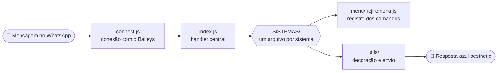

<div align="center">


<a href="https://git.io/typing-svg"></a>

<br/>


[](https://whatsapp.com/channel/0029Vb8rVXsDOQIWsbKuAd34)
[](https://wa.me/5567998229189)
[](https://lopes-api.store)

<br/>

**𓆩🩵𓆪 ⋆｡° ʙᴏᴛ ᴅᴇ ᴡʜᴀᴛsᴀᴘᴘ ᴄᴏᴍ ɪᴅᴇɴᴛɪᴅᴀᴅᴇ ᴀᴢᴜʟ ᴀᴇsᴛʜᴇᴛɪᴄ °｡⋆ 𓆩🩵𓆪**

</div>

<br/>

> [!IMPORTANT]
> 🩵 **Obrigado por baixar essa base!** Ela é **gratuita** e foi feita com muito carinho.
> Qualquer dúvida, é só chamar o [suporte](https://wa.me/5567998229189) e **siga o [canal](https://whatsapp.com/channel/0029Vb8rVXsDOQIWsbKuAd34) para receber as ATUALIZAÇÕES**.
> 🚫 **É proibido vender, revender ou cobrar por esta base.** Se você pagou por ela, foi enganado(a).

---

## 📚 Índice

<table>
<tr>
<td>

1. [O que é](#-o-que-é)
2. [O que o bot faz](#-o-que-o-bot-faz)
3. [Como funciona](#-como-funciona)
4. [Requisitos](#-requisitos)
5. [Instalação](#-instalação)
6. [Primeiro login (pairing code)](#-primeiro-login-pairing-code)

</td>
<td>

7. [Configuração (`config.json`)](#-configuração-configjson)
8. [Como usar](#-como-usar)
9. [🎧 Áudio do menu](#-áudio-do-menu)
10. [Estrutura do projeto](#-estrutura-do-projeto)
11. [Adicionar um comando novo](#-como-adicionar-um-comando-novo)
12. [Deixar rodando 24h](#-deixar-rodando-24h)
13. [Problemas comuns](#-problemas-comuns)
14. [Suporte, regras e créditos](#-suporte-regras-e-créditos)

</td>
</tr>
</table>

---

## 💙 O que é

O **System Nejire** é um bot de WhatsApp feito em **Node.js** em cima da biblioteca **Baileys** (`@systemzero/baileys`), inspirado na Nejire Hado. Todas as respostas passam por uma decoração azul/oceano (fontes miúdas, emojis azuis e molduras), e o menu principal é interativo, com foto, botões e lista.

O login é feito por **código de pareamento** (sem QR code), então dá pra rodar até no celular, pelo Termux.

> [!TIP]
> Para ver tudo dentro do WhatsApp, mande `×menu`.

## ✨ O que o bot faz

O menu principal tem **mais de 660 comandos** divididos em categorias, fora os 4 RPGs:

| | Categoria | O que tem |
|:-:|---|---|
| 👑 | **Dono** | broadcast, backup, autobackup, ligar/desligar comandos, adicionar donos, trocar nome/foto/recado do bot, etc. |
| 🫐 | **Admin** | antis (link, fig, imagem, vídeo, áudio, doc, trava, fake, porn, canal, bot…), ban, promover, rebaixar, `postarstatus` |
| 🐚 | **Boas-vindas** | mensagem de entrada e saída de grupo, configurável |
| 🗣️ | **Figurinhas** | criar e converter figurinhas |
| 🏊 | **Download** | play (áudio/vídeo), TikTok, Instagram, Spotify, Pinterest, letra de música |
| 🧊 | **Cubo 3D** | renderizador 3D próprio que gera imagem/vídeo |
| 🌊 | **IA & diversão** | IA de conversa, modo AI, memes, piadas, frases motivacionais, curiosidades, etc. |
| 🧩 | **Utilidades** | calculadoras, conversores, geradores, validadores, texto, data e hora |
| 🕵️ | **Detetive** | jogo de investigação com casos |
| 🎲 | **Jogos & sorte** | quiz, roleta, dados, loteria, cartas, sinuca |
| 💎 | **VIP / Aluguel** | planos VIP e aluguel do bot para grupos |
| 🐾 | **Sistemas** | economia (Nejicoins), XP, ranking, perfil, daily, trabalho |
| 🎣 | **Pesca** | jogo de pesca completo, com **mini app web** |
| 🎮 | **RPGs** | **Minecraft RPG**, **Simulador de Vida**, **Miraculous RPG** e **Fantasia RPG** |

<details>
<summary><b>🎮 Ver os 4 RPGs</b></summary>

<br/>

| RPG | Ajuda | Começar |
|---|---|---|
| ⛏️ Minecraft RPG | `×mcajuda` | `×mccomecar` |
| 🏙️ Simulador de Vida | `×vdajuda` | `×vdcomecar` |
| 🐞 Miraculous RPG | `×mrajuda` | `×mrcomecar` |
| 🐉 Fantasia RPG | `×faajuda` | `×facomecar` |

Use `×rpgs` para listar todos.

</details>

<details>
<summary><b>➕ Outros recursos</b></summary>

<br/>

- 🤖 **Sub-bots**: qualquer pessoa pode virar um sub-bot do Nejire (`×subbot 5511999999999`).
- 🧠 **Modo AI**, **antipv**, **anticall**, **autoler**, **presença** e **autobackup**.
- 📱 **Menu por dispositivo**: menu com botões (Android) ou menu em texto (iPhone).
- 🎧 **Áudio no menu**: o dono marca um áudio e ele sai junto toda vez que o menu é pedido.

</details>

## 🧬 Como funciona



## 📦 Requisitos

-  e **npm** (recomendado Node 20+)
-  instalado (usado em figurinhas animadas, áudio e vídeo)
- 📱 Um **número de WhatsApp** só pro bot (não use o seu principal)
- 🌐 Internet estável

## 🛠️ Instalação

<details open>
<summary><b>🐧 Linux / VPS (Ubuntu, Debian)</b></summary>

```bash
sudo apt update && sudo apt install -y git ffmpeg nodejs npm
git clone https://github.com/kauanbreno179-stack/System-Nejire.git
cd System-Nejire
npm install
```

</details>

<details>
<summary><b>📱 Termux (Android)</b></summary>

```bash
pkg update && pkg upgrade -y
pkg install -y git nodejs ffmpeg
git clone https://github.com/kauanbreno179-stack/System-Nejire.git
cd System-Nejire
npm install
```

</details>

<details>
<summary><b>🪟 Windows</b></summary>

1. Instale o [Node.js LTS](https://nodejs.org) e o [Git](https://git-scm.com).
2. Instale o [ffmpeg](https://ffmpeg.org/download.html) e coloque no `PATH`.
3. No terminal:

```bash
git clone https://github.com/kauanbreno179-stack/System-Nejire.git
cd System-Nejire
npm install
```

</details>

> [!NOTE]
> O arquivo `autoinstall.js` roda toda vez que o bot inicia e instala sozinho qualquer módulo que estiver faltando.

## 🔑 Primeiro login (pairing code)

1. Configure o `config.json` (veja a próxima seção), principalmente o **`numeroDono`**.
2. Inicie o bot:

   ```bash
   npm start
   ```

3. O terminal vai pedir: **"Número da Nejire, com DDI e DDD"**. Digite o número do bot, só números. Exemplo: `5511999999999`.
4. Vai aparecer um **código de 8 letras/números**.
5. No WhatsApp do bot: **Aparelhos conectados → Conectar um aparelho → Conectar com número de telefone** e digite o código **em até 60 segundos**.
6. Quando aparecer `✅ System Nejire conectada!`, está pronto.

A sessão fica salva em `sessions/main`. Nas próximas vezes o bot conecta sozinho.

> [!WARNING]
> Se a sessão quebrar (deslogada ou revogada), apague a pasta `sessions/main` e faça o pareamento de novo. **Nunca suba a pasta `sessions/` para o GitHub**, ela é o login do bot.

## ⚙️ Configuração (`config.json`)

| Campo | Para que serve |
|---|---|
| `nome` | Nome do bot, usado nos menus e rodapés |
| `versao` | Versão exibida (dá pra mudar com `×definirversao`) |
| `prefixo` | Prefixo dos comandos. Hoje é `×` |
| `numeroDono` | **Seu número**, com DDI e DDD, só números. É ele que libera os comandos de dono |
| `nomeDono` | Seu nome |
| `emojiPrincipal` | Emoji usado nas reações |
| `tema` | Cores do tema (`corPrincipal`, `corSecundaria`, `corDestaque`) |
| `figurinha` | `packname` e `author` das figurinhas |
| `canal` | `id`, `nome` e `url` do canal do WhatsApp (aparece no menu) |
| `plataforma.padrao` | `auto`, `android` ou `iphone`. Define se o menu sai com botões ou em texto |
| `webapp` | `habilitado`, `porta` e `urlPublica` do mini app de pesca. Troque `SEU-IP-OU-DOMINIO` pelo seu IP/domínio |
| `zoneApi` | URL e chave da API usada por IA, TTS e buscas |
| `lopesApi` | URL e token da API usada pelos downloaders |
| `modoai` | Limites do modo AI (histórico por pessoa e tamanho da resposta) |
| `boasVindas` | Textos de entrada e saída de grupo (`@user`, `@group` e `@membros` são trocados automaticamente) |
| `vip.planos` / `aluguel.planos` | Planos, dias e preços |
| `economia` | Nome da moeda e limites do `daily` |
| `decoracao` | Liga/desliga a decoração azul e a fonte miúda |

## 🚀 Como usar

O prefixo padrão é `×`. Alguns exemplos:

| Comando | O que faz |
|---|---|
| `×menu` | Abre o menu principal |
| `×ping` | Testa se o bot está vivo |
| `×figurinha` | Cria figurinha de uma imagem/vídeo (envie ou responda) |
| `×play nome da música` | Baixa e envia a música |
| `×pesca` | Abre o painel de pesca |
| `×rpgs` | Lista os 4 RPGs |
| `×alugar` | Mostra os planos de aluguel |
| `×subbot 5511999999999` | Cria um sub-bot |
| `×modo-adr` / `×modo-ios` | Escolhe o menu com botões ou em texto |

## 🎧 Áudio do menu

Você marca um áudio uma vez, o bot guarda e, **toda vez que alguém pedir o menu** (`×menu`, `×nejire`, `×help`, `×ajuda`), ele manda o menu **e logo depois o áudio**.

### Como configurar

1. Envie (ou encaminhe) o áudio que você quer no chat com o bot.
2. **Marque (responda) esse áudio** com:

   ```
   ×definiraudiomenu
   ```

3. Pronto. O bot salva em `menu/audio/` e já deixa ativo.
4. Teste com `×menu` ou com `×testaraudiomenu`.

### Comandos (só o dono usa)

| Comando | O que faz |
|---|---|
| `×definiraudiomenu` | Marque um áudio para salvar como áudio do menu (também aceita mp3 enviado como arquivo) |
| `×audiomenu` | Mostra o status (ligado/desligado e se tem áudio salvo) |
| `×audiomenu on` / `×audiomenu off` | Liga ou desliga sem apagar o áudio |
| `×testaraudiomenu` | Manda o áudio salvo só pra você ouvir |
| `×removeraudiomenu` | Apaga o áudio salvo |

Apelidos: `×setaudiomenu`, `×addaudiomenu`, `×delaudiomenu`, `×rmaudiomenu`, `×testeaudiomenu`.

> [!NOTE]
> - O áudio é guardado no formato original: **nota de voz** sai como nota de voz, **mp3/áudio comum** sai como áudio comum.
> - Limite de **16 MB** (limite do WhatsApp para áudio). Prefira arquivos pequenos.
> - Se o envio do áudio falhar, o menu **continua saindo normalmente**.
> - Para trocar o áudio, é só marcar outro com `×definiraudiomenu`.

## 🗂️ Estrutura do projeto

<details>
<summary><b>📁 Ver a árvore de pastas</b></summary>

```
System-Nejire/
├── connect.js            # ponto de entrada: conecta no WhatsApp (npm start)
├── index.js              # handler central: recebe as mensagens e chama os comandos
├── subbot.js             # sistema de sub-bots
├── autoinstall.js        # instala módulos faltando ao iniciar
├── config.json           # configuração do bot
├── package.json
├── SISTEMAS/             # a lógica dos comandos, um arquivo por sistema
│   ├── lote2/            # comandos do lote 2 (calculadoras, conversões, geradores…)
│   ├── lote3/            # os 4 RPGs (minecraft, vida, miraculous, fantasia)
│   ├── cubo3d/           # renderizador 3D
│   ├── menuaudio.js      # áudio do menu
│   └── postarstatus.js   # postar status de grupo
├── menu/
│   ├── nejiremenu.js     # registro central de TODOS os comandos e categorias do menu
│   ├── menuzero.js       # menu interativo com botões
│   ├── botoes.js         # montagem dos botões/listas
│   ├── foto/             # imagem do menu
│   └── audio/            # áudio do menu (criado por ×definiraudiomenu)
├── assets/               # imagens usadas no README
├── utils/                # funções de apoio (envio, decoração, jid, ffmpeg, db…)
├── sticker/              # metadados de figurinha (exif)
├── webapp/               # mini app web da pesca (Express)
├── data/                 # dados fixos (casos do detetive)
├── database/             # dados dos usuários (JSON, criados automaticamente)
└── sessions/             # sessão do WhatsApp (não sobe pro GitHub)
```

</details>

## ➕ Como adicionar um comando novo

Cada sistema em `SISTEMAS/` exporta uma função `tratar(ctx)` que devolve `true` quando o comando era dele. Exemplo mínimo:

```js
// SISTEMAS/oi.js
async function tratar({ command, reply, prefix }) {
    if (command !== "oizinho") return false;
    await reply(`oii! use ${prefix}menu pra ver meus comandos 🩵`);
    return true;
}
module.exports = { tratar };
```

Depois:

1. No `index.js`, importe o arquivo e chame-o junto dos outros, antes do `switch (command)`:

   ```js
   const Oi = require("./SISTEMAS/oi.js");
   // ...
   if (await Oi.tratar({ conn, info, from, sender, isGroup, isDono, args, q, command, prefix, config,
     reply, reagir, enviar, getMediaBuffer, exigirGrupo, exigirAdmin, exigirDono })) return;
   ```

2. Em `menu/nejiremenu.js`, adicione o comando na categoria certa dentro de `CATEGORIAS`:

   ```js
   { cmd: "oizinho", desc: "manda um oi" }
   ```

> [!TIP]
> Helpers que já vêm no `ctx`: `reply(texto)`, `reagir(emoji)`, `enviar(conn, jid, conteudo)`, `getMediaBuffer(msg, tipo)`, `exigirDono()`, `exigirAdmin()`, `exigirGrupo()`.

## ♻️ Deixar rodando 24h

Com **PM2** (recomendado em VPS):

```bash
npm install -g pm2
pm2 start connect.js --name nejire
pm2 save
pm2 startup
```

Comandos úteis: `pm2 logs nejire`, `pm2 restart nejire`, `pm2 stop nejire`.

> [!IMPORTANT]
> Faça o **primeiro login** com `npm start` (precisa digitar o número). Depois que a sessão existir, pode usar o PM2.

No Termux: `pkg install tmux`, abra uma sessão (`tmux`) e rode `npm start` dentro dela.

## 🩹 Problemas comuns

<details>
<summary><b>Ver a tabela de problemas e soluções</b></summary>

<br/>

| Problema | Solução |
|---|---|
| O código de pareamento não conecta | Digite em até 60s, com o número certo (DDI + DDD). Se falhar, apague `sessions/main` e tente de novo |
| `Sessão deslogada` / `403` | Apague `sessions/main` e faça o pareamento de novo |
| `Conflito: outra sessão ativa` | O mesmo número está conectado em outro lugar. Feche a outra instância |
| Erro `405` | Limite de taxa do WhatsApp: o bot espera 60s sozinho e reconecta |
| Figurinha/áudio não funciona | Instale o **ffmpeg** |
| Menu sem botões | Use `×modo-adr` (Android) ou ajuste `plataforma.padrao` no `config.json` |
| O áudio do menu não sai | Confira `×audiomenu` (precisa estar ligado e com áudio salvo) e teste com `×testaraudiomenu` |
| Erro de módulo não encontrado | Rode `npm install` |

</details>

## 🌐 Veja minha API

<div align="center">

[](https://lopes-api.store)

</div>

## 📜 Suporte, regras e créditos

| | |
|---|---|
| 💬 **Suporte** | [wa.me/5567998229189](https://wa.me/5567998229189) |
| 📢 **Canal (atualizações)** | [Clique para seguir](https://whatsapp.com/channel/0029Vb8rVXsDOQIWsbKuAd34) |
| 👤 **Criador** | **Lopes** (by lopes) |
| 📚 **Base** | [Baileys](https://github.com/WhiskeySockets/Baileys) (`@systemzero/baileys`) |
| 📄 **Licença** | MIT (veja o campo `license` do `package.json`) |

> [!CAUTION]
> ✖ **Proibido vender, revender ou cobrar** por esta base, total ou parcialmente.
> ✖ **Proibido remover os créditos** do criador.
> ✔ Pode usar, estudar, editar e personalizar para uso próprio, mantendo os créditos.

<br/>

<div align="center">

**⋆｡° 𓆩🩵𓆪 ᴄʜᴀɴɴᴇʟ ɴ³ᴊɪʀᴇ 𓆩🩵𓆪 °｡⋆**

<a href="./menu/foto/nejire-menu.jpg">
  
</a>

<sub>🩵 clique na imagem para abrir em tamanho original 🩵</sub>

<br/>

🩵 Feito com muito azul, by **Lopes** 🩵


</div>
